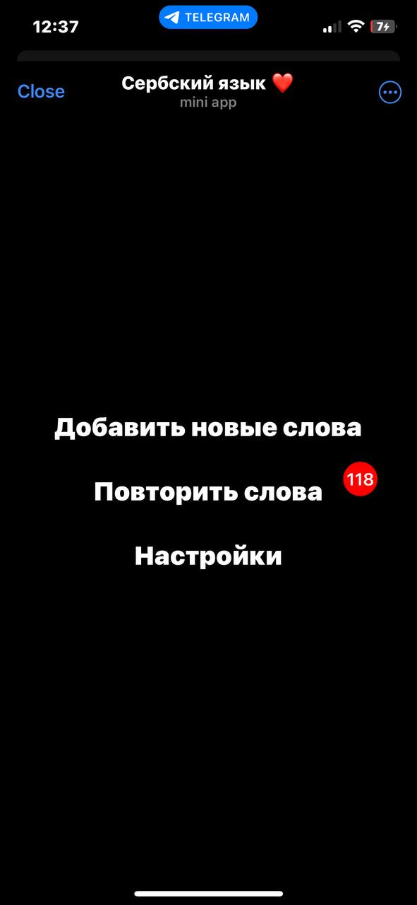
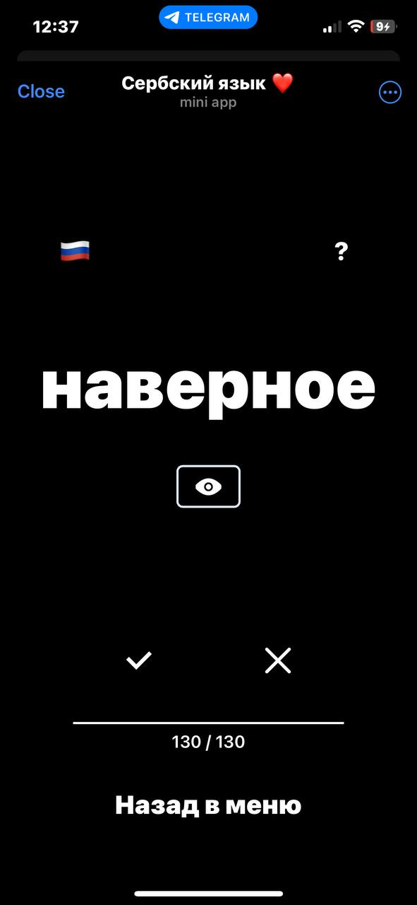
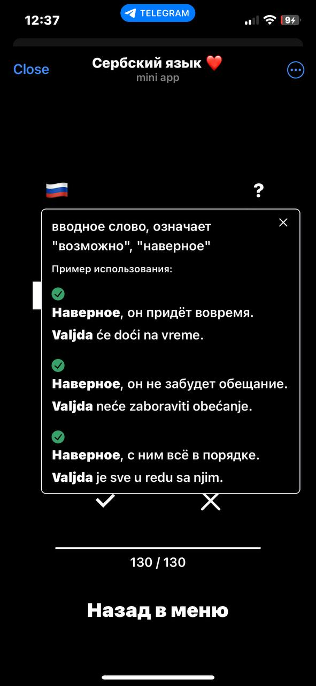
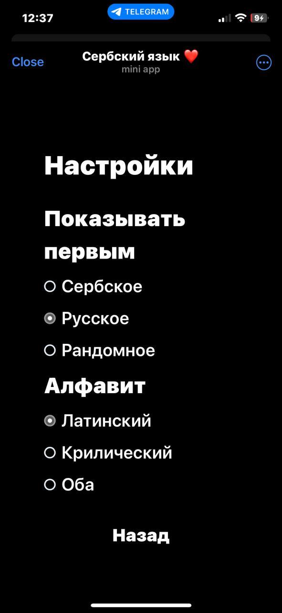
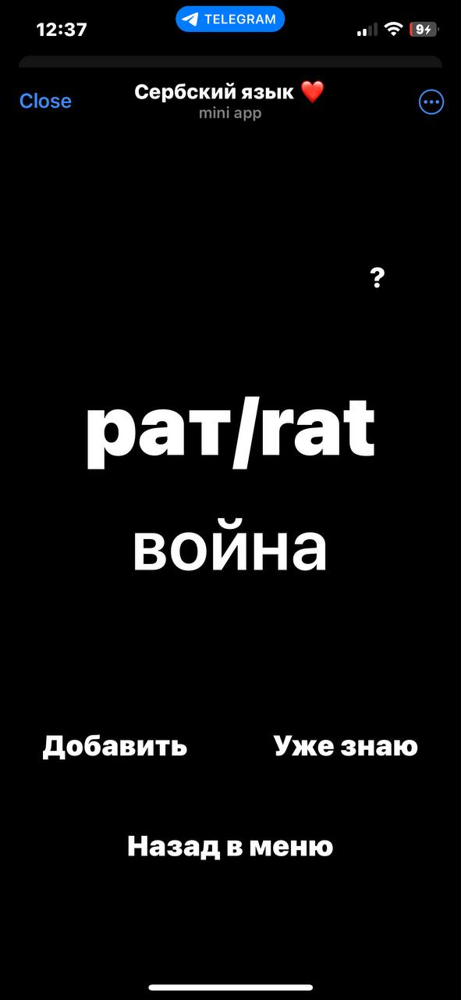

# Full Stack FastAPI App
New vocalblurary Learning Telegram Bot

A modern web application built with a FastAPI backend and React frontend. This project combines a Telegram bot with an embedded web application designed to help users efficiently learn new words and expand their vocabulary in Serbian language. The app utilizes a spaced repetition algorithm to optimize the learning process and improve long-term retention of vocabulary.

## Images of application

    
    
    
    
    

## About technology stack and app architecture you can find in the [README_for_hiring_managers.md](./README_for_hiring_managers.md) file.
